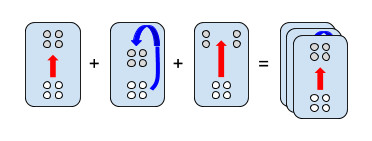

# Card Commander

Use cards to control your armies and defeat your opponents.

## Concept

In a standard RTS, most decisions are made on a very tactical level. The faster you click, the more you get done, and the better the outcome. Unfortunately, this means that skill is largely a measure of dexterity, not intelligence. Starcraft vs. Chess.

I propose a game where the reverse is true. The winner is the player with the better grasp on strategy, not time management. To do this, we need higher level abstractions which encapsulate all the fiddly bits you would control manually in a traditional RTS.

Sample abstractions include:

* Flank the enemy
* Take defensive positions
* Perform an orderly retreat

These abstractions are represented as cards. Whenever you play a card, your troops follow the order you’ve given them. The goal is to keep the rate at which you issue commands to a comfortable level. In Starcraft, an expert might issue 200 commands per minute. In Card Commander, a similar level of play might only require 10 commands per minute.

Because time management is no longer the primary challenge, mastery becomes a function of the cards you choose, and the sequence and timing in which you play them. As your skill increases, more cards become available to you, adding further complexity to the game.

## Gameplay

The game is a linear campaign, consisting of individual battles. Each battle starts with an army and a deck of cards. The enemy attack may consist of multiple waves. The goal is to defeat each wave by utilizing a winning strategy using the cards available to you.

Types of cards:

* Attack (e.g. frontal assault)
* Positional (e.g. retreat, flank)
* Reinforcement (e.g. add 5 archers to the battle)
* Enhancement (e.g. give infantry double speed)

Gameplay starts slow and gradually becomes more complex and difficult as you advance. However, it should never feel rushed. You win by thinking multiple steps ahead and anticipating the enemy, not by playing cards as quickly as possible.

### Early game

You start with a small group of infantry and a few basic cards.

When the enemy attacks, you start playing cards in an attempt to defeat them.

If you win, you’re rewarded with a new card, or a new type of soldier, and may continue to the next battle.

If you lose, you must repeat the battle until you win.

### Mid game

By this time, you have a medium-sized army with varying numbers of infantry, armor, and ranged units.

You are limited to five cards at a time. Additional cards are drawn from the deck as you play them.

You may split your army into as many as three groups. Commands may be issued to an individual group, or the army as a whole.

### Late game

You gain access to artillery equipment as you encounter enemy outposts and approach their base.

You are able to stack as many as three cards together. Once played, a stack issues each command sequentially.

As your groups gain experience, they are able to issue their own commands when left idle.

## Storyline

TBD

## Open questions

* How much of this is reasonable to build in a year? Better to build something simple that works than something complex which doesn’t.
* How hard is it to build an AI? Basic AI would be nice boost for gameplay/replayability.
* Even in 2D, this game may require substantial art direction. Can we use procedural generation to offload some of the effort?
* What platform should we develop for? (i.e. iOS is easier and more lucrative, but you have to have a Mac to write apps for it)
